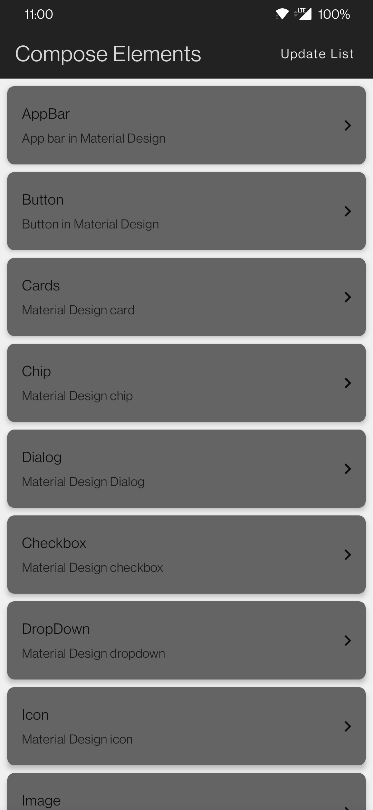
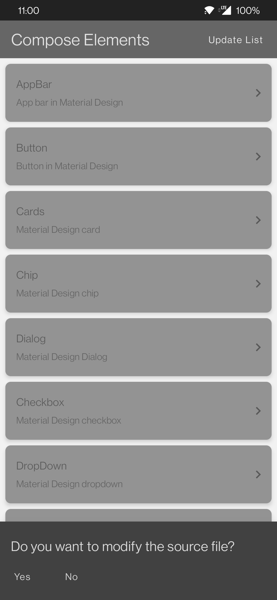
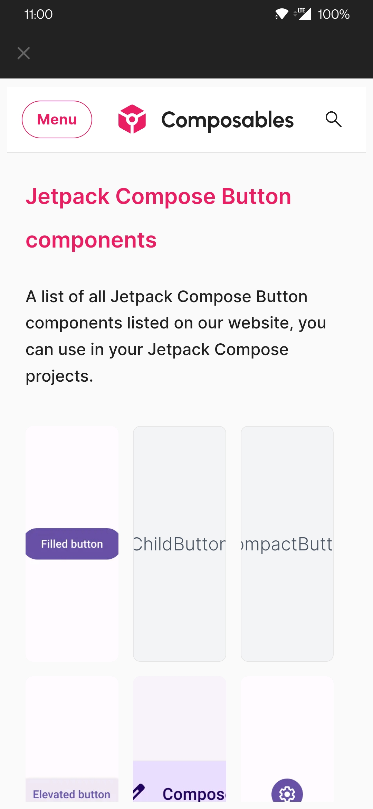
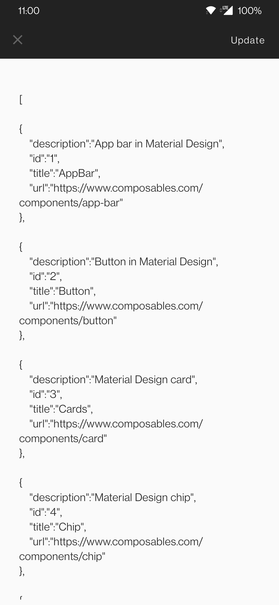

# Jetpack-Compose-Components
An Android Application with Information regarding basic Jetpack Components.

## Features

- This application has home page with list of Components.
- Clicking on each component it is redirected to WebView with compose code about the component.
- Initially, ie first install Components are empty hence Update List->No. Loads the database.
- Components are fetched from source JSON file which are then loaded in RoomDB.
- Components can me modified using Update List action->Yes.

---
## Screenshots

---
## Components/Architecture Used 

- Application is build using Kotlin and Jetpack Compose.
- Built in MVVM/MVI clean architecture.
- Database is an structured DB. RoomDB is used to perform operations.
- Hilt Dependency Injection.
